### code
- https://github.com/eacevedof/prj_python37/tree/master/wa-chatgpt/be-api/modules/lang_chain/application/lc_ask_question
- [curso](https://www.udemy.com/course/langchain-y-llm-desarrolla-aplicaciones-de-ia-en-python/learn/lecture/45189465)

### Neurona artificial:
- 
- Es una representacion matematica de una neurona biologica
- Una neurona se compone de:
  1. Xn entradas
  2. Wi pesos 
  3. Bj bias (sesgo)
  4. f **funcion de activación**
    - aplica funciones matematicas complejas que evitan la linealidad en el modelo
    - Ejemplos:
      - Sigmoide: 
      - Tangente hiperbolica:  
      - ... reul, leaky ReLU, etc cada una se ajusta a un tipo de problema
  5. Output

### Red de neuronas:
- Se compone de:
  - Red de neuronas para aceptar datos de entreda.
  - Red capa oculta para el procesamiento de cada una de las etapas.
  - Neurona de salida.

### Transformer:
- 
- Red neuronal que consta de dos capas.
- Capa de codificacion.
  - Codifica la entrada y en el contexto que se ha proporionado en un set de vecotes 
- Capa de decodificacion.
- **Mecanismo de atención**
  - El mecanismo de atención es la base del modelo Transformer, donde se utiliza la variante llamada self-attention o atención propia. Este mecanismo permite que el modelo analice cómo cada palabra en una oración está relacionada con otras palabras en la misma oración.
  - Es una herramienta poderosa que ayuda a los modelos de IA a comprender mejor las entradas, enfocándose en lo relevante y descartando lo redundante o menos importante

## Langchain
- Framework para desarrollar apps impulsadas por LLMs.
- Consta de módulos o componentes.
- [https://python.langchain.com](https://python.langchain.com/docs/introduction/)
- Proveedores con los que langchain tiene conectividad:
  - [https://python.langchain.com/docs/integrations/providers/](https://python.langchain.com/docs/integrations/providers/)

### Componentes:
- 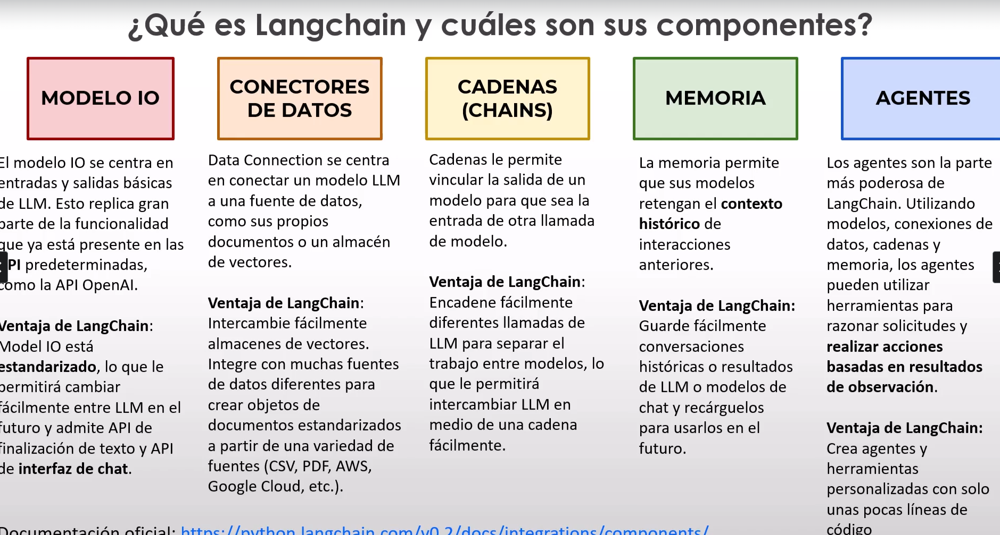
- **Modelo IO**. 
  - Componente que sigue un estandar tipo interfaz que permite ser sustituido por otro modelo. 
- **Conectores de datos**
  - Conecta un modelo LLM a una fuente de datos. 
- **Cadenas**
  - Permite enlazar salidas de un llm con entradas de otro. Pe. App que en primera fase resume un contenido de texto y seguidamente lo
  traduce a otro idioma.
- **Memoria** 
  - Permite que retenga un contexto historico de interacciones. 
- **Agentes**
  - Van a ser capaces de disernir entre diferentes tipos de herramientas cual es la más adecuada para la solicitud que se le hace.

### Casos de uso:
- Aplicaciones de preguntas y respuestas
- Resumir información
- Consultar bases de datos
- Consulta a bds
- Interaccion con apis
- Agentes
- Chatbots

- Langchain necesita poder enviar texto al LLM y también recibir y trabajar con sus resultados.
- El uso de LC y el componente **Modelo IO** nos permitirá construir cadenas más adelante, pero también nos 
dará más flexibilidad para cambiar de proveedor de LLM en el futuro por cumplir con la interfaz
- En las solicitudes API debemos tener en cuenta dos parámetros importantes:
  - **system message**
    - cómo se debe comportar el LLM 
  - **human message**
    - solicitud del usuario 
- [Api con chat models](https://python.langchain.com/docs/integrations/chat/)
  - Ejemplo [**Chat Open AI**](https://python.langchain.com/api_reference/openai/chat_models/langchain_openai.chat_models.base.ChatOpenAI.html)

### ejemplos 
- **invoke**
- invoke trata solo un mensaje
- aplicando un rol al sistema la respesta tendrá un mejor contexto
```python
def donde_se_encuentra_lima_system_human_message(self) -> str:
    str_content = "¿Puedes decirme dónde se encuentra Lima?"
    human_message = HumanMessage(content=str_content)

    system_rol = "Eres un historiador que conoce los detalles de todas las ciudades del mundo"
    system_message = SystemMessage(content=system_rol)

    ai_message = self._get_chat_openai().invoke([
        system_message,
        human_message
    ])
    return ai_message.content
```
- 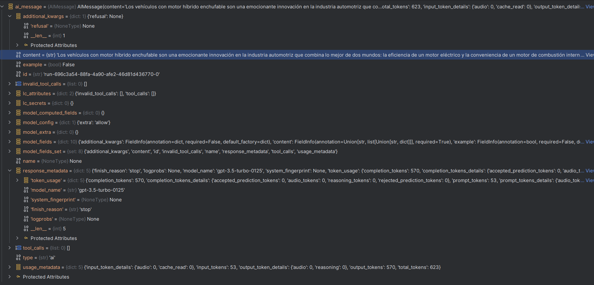
- **generate**
- multiples mensajes con multiples roles
```python
  def ejemplo_multi_rol_con_generate(self) -> dict:
      dic_prompt = {
          "history": {
              "system_role": "Eres un historiador que conoce los detalles de todas las ciudades del mundo",
              "question": "¿Puedes decirme dónde se encuentra Cáceres?",
          },
          "rude_young_person": {
              "system_role": "Eres un joven rudo que no le gusta que le pregunten, solo quiere estar de fiesta",
              "question": "¿Puedes decirme dónde se encuentra Cáceres?",
          }
      }
      llm_result = self._get_chat_openai().generate([
        [
            SystemMessage(content=dic_prompt.get("history").get("system_role")),
            HumanMessage(content=dic_prompt.get("history").get("question"))
        ],
        [
            SystemMessage(content=dic_prompt.get("rude_young_person").get("system_role")),
            HumanMessage(content=dic_prompt.get("rude_young_person").get("question"))
        ],
      ])
      generated_texts = llm_result.generations
      return {
          "history": {
              "question": dic_prompt.get("history").get("question"),
              "response": generated_texts[0][0].text,
          },
          "rude_young_person": {
              "question": dic_prompt.get("rude_young_person").get("question"),
              "response": generated_texts[1][0].text,
          },
      }
```
- respuesta:
- 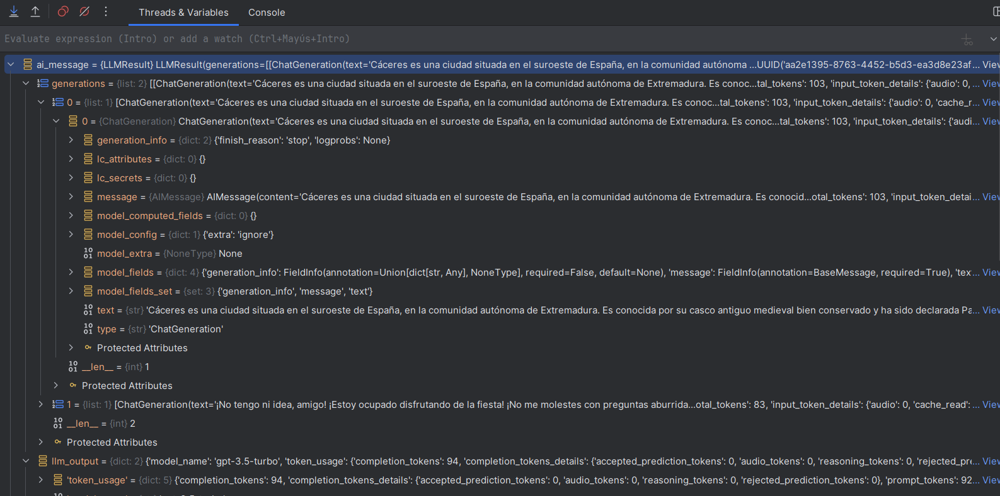
- 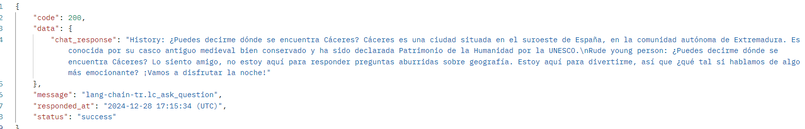

### Plantillas de prompts
- Permiten modificar nuestras indicaciones de entrada al LLM fácilmente.
- Ofrencen un enfoque más estructurado para pasar entradas formateadas evitando formalizarlas con `f o xxx.format()`
ya que **PromptTemplate** las convierte en nombres de parámetros de función que podemos pasar.
- Es recomendable usar las plantillas para estandarizar los mensajes entre las distintas apps.
```python
def ejemplo_prompt_template_especialista_en_coches(self) -> str:
    str_sys_template = "Eres una IA especializada en coches de tipo {car_type} y generar artículos que leen en {read_time}"
    str_human_template = "Necesito un artículo para vehículos con motor {motor_type}"

    dic_prompt = {
        "car_specialist": {
            "system": {
                "prompt_tpl": SystemMessagePromptTemplate.from_template(str_sys_template),
            },
            "human": {
                "prompt_tpl": HumanMessagePromptTemplate.from_template(str_human_template),
            }
        },
    }
    chat_prompt = ChatPromptTemplate.from_messages([
        dic_prompt.get("car_specialist").get("system").get("prompt_tpl"),
        dic_prompt.get("car_specialist").get("human").get("prompt_tpl"),
    ])

    chat_prompt_value = chat_prompt.format_prompt(
        motor_type="hibrido enchufable",
        read_time="3 min",
        car_type="japoneses",
    )
    final_request = chat_prompt_value.to_messages()
    ai_message = self._get_chat_openai().invoke(final_request)
    return ai_message.content
```
- 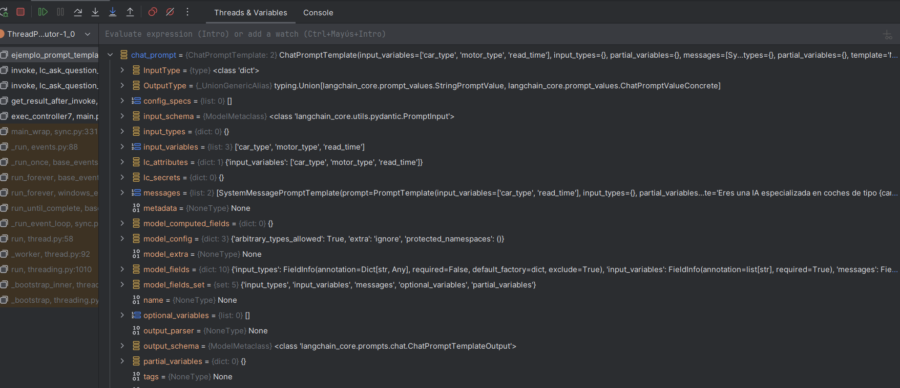
- 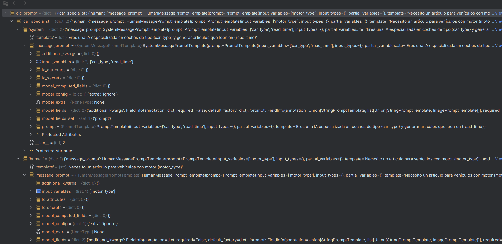
- 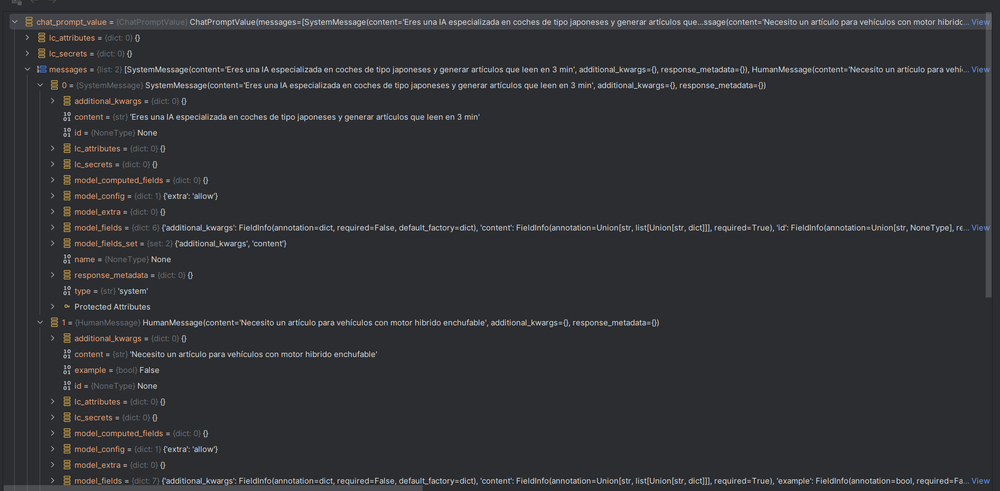

### Parsear y procesar la salida
```python
from langchain.output_parsers import (
    CommaSeparatedListOutputParser,
    DatetimeOutputParser,
    OutputFixingParser
)
def ejemplo_template_system_prompt(self) -> str:
    prompt_conf = {
        "history": {
            "system": {
                "prompt_tpl": SystemMessagePromptTemplate.from_template(
                    "Tienes que responder únicamente con un patrón de fechas"
                ),
            },
            "human": {
                "request": "¿Cuando es el día de la declaración de la independencia de los EEUU",
                "prompt_tpl": HumanMessagePromptTemplate.from_template(
                    "{request}\n{format_instructions}"
                ),
            }
        },
    }

    chat_prompt_tpl = ChatPromptTemplate.from_messages([
        prompt_conf.get("history").get("system").get("prompt_tpl"),
        prompt_conf.get("history").get("human").get("prompt_tpl"),
    ])

    dt_output_parser = DatetimeOutputParser()
    chat_prompt_formatted = chat_prompt_tpl.format_prompt(
        request = prompt_conf.get("history").get("human").get("request"),
        format_instructions = dt_output_parser.get_format_instructions()
    )

    lm_input_request = chat_prompt_formatted.to_messages()
    ai_message = self._get_chat_openai().invoke(lm_input_request)
    str_dt_unformatted = ai_message.content # 1776-07-04T00:00:00:00000Z
    dt_independence_day = dt_output_parser.parse(str_dt_unformatted) # datetime.datetime(1776, 7, 4, 0, 0)
    print(dt_independence_day) # 1776-07-04 00:00:00

    return dt_independence_day.strftime("%Y-%m-%d")

def ejemplo_parser_auto_fix(self) -> str:
    str_human_template = "{request}\n{format_instructions}"
    prompt_conf = {
        "history": {
            "human": {
                "request": "¿Cuando es el día de la declaración de la independencia de los EEUU",
                "prompt_tpl": HumanMessagePromptTemplate.from_template(str_human_template),
            }
        },
    }

    chat_prompt_tpl = ChatPromptTemplate.from_messages([
        prompt_conf.get("history").get("human").get("prompt_tpl"),
    ])

    dt_output_parser = DatetimeOutputParser()
    chat_prompt_formatted = chat_prompt_tpl.format_prompt(
        request = prompt_conf.get("history").get("human").get("request"),
        format_instructions = dt_output_parser.get_format_instructions()
    )

    openai_chat = self._get_chat_openai()
    lm_input_request = chat_prompt_formatted.to_messages()

    ai_message = openai_chat.invoke(lm_input_request)
    str_dt_unformatted = ai_message.content # 1776-07-04T00:00:00:00000Z
    fixing_parser = OutputFixingParser.from_llm(
        parser = dt_output_parser,
        llm = openai_chat,
    )

    dt_independence_day = fixing_parser.parse(str_dt_unformatted) # datetime.datetime(1776, 7, 4, 0, 0)
    print(dt_independence_day) # 1776-07-04 00:00:00

    return dt_independence_day.strftime("%Y-%m-%d")


def ejemplo_parser_fecha(self) -> str:
    str_human_template = "{request}\n{format_instructions}"
    prompt_conf = {
        "history": {
            "human": {
                "request": "¿Cuando es el día de la declaración de la independencia de los EEUU",
                "prompt_tpl": HumanMessagePromptTemplate.from_template(str_human_template),
            }
        },
    }
    chat_prompt_tpl = ChatPromptTemplate.from_messages([
        prompt_conf.get("history").get("human").get("prompt_tpl"),
    ])
    dt_output_parser = DatetimeOutputParser()

    chat_prompt_formatted = chat_prompt_tpl.format_prompt(
      request = prompt_conf.get("history").get("human").get("request"),
        format_instructions = dt_output_parser.get_format_instructions(),
    )
    lm_input_request = chat_prompt_formatted.to_messages()
    ai_message = self._get_chat_openai().invoke(lm_input_request)
    str_dt_unformatted = ai_message.content # 1776-07-04T00:00:00:00000Z

    dt_independence_day = dt_output_parser.parse(str_dt_unformatted)
    print(dt_independence_day) # 1776-07-04 00:00:00

    return dt_independence_day.strftime("%Y-%m-%d")
```
### serializacion de prompts
- Permite guardar plantillas complejas en formato JSON para su reutilización.
```python
from langchain_core.prompts import (
    BasePromptTemplate,
    PromptTemplate
)
def ejemplo_prompt_tamplate_save(self) -> str:
    prompt_conf = {
        "history": {
            "human": {
                "user_question": "Cómo se prepara un bizcocho de vainilla",
                "str_prompt_tpl": "Pregunta: {user_question}\n\nRespuesta: Vamos a verlo paso a paso",
            }
        },
    }
    self.__save_prompt_tpl_independece_day(
        prompt_conf.get("history").get("human").get("str_prompt_tpl")
    )
    chat_prompt_tpl = self.__get_independence_day_saved_prompt()

    chat_prompt_formatted = chat_prompt_tpl.format_prompt(
        user_question = prompt_conf.get("history").get("human").get("user_question"),
    )

    lm_input_request = chat_prompt_formatted.to_messages()
    ai_message = self._get_chat_openai().invoke(lm_input_request)
    str_response = ai_message.content

    return str_response

def __save_prompt_tpl_independece_day(self, tpl: str) -> None:
    chat_prompt_tpl = PromptTemplate(
        template = tpl
    )
    chat_prompt_tpl.save("history-independence-day.json")

def __get_independence_day_saved_prompt(self) -> BasePromptTemplate:
    return load_prompt("history-independence-day.json")
```
- ejemplo **history-independence-day.json**
```json
{
    "name": null,
    "input_variables": [
        "user_question"
    ],
    "optional_variables": [],
    "output_parser": null,
    "partial_variables": {},
    "metadata": null,
    "tags": null,
    "template": "Pregunta: {user_question}\n\nRespuesta: Vamos a verlo paso a paso",
    "template_format": "f-string",
    "validate_template": false,
    "_type": "prompt"
}
```
### conectores de datos
- 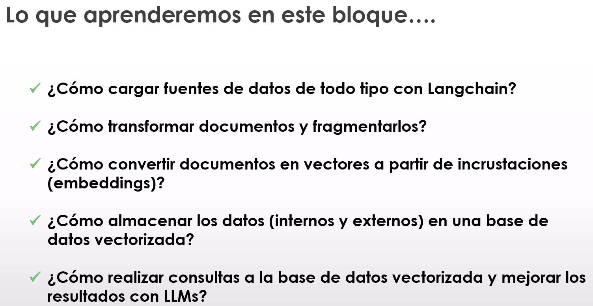
#### cargadores de documentos (loaders)
- Langchain viene con herramientas de carga integradas. Estas son librerias que mapean un tipo de documento 
a nivel de infraestructura con un objeto de python.
- `pip install langchain-community` con esto se instala algunos loaders
- [documentación loaders](https://python.langchain.com/docs/how_to/#document-loaders)
```python
from langchain.document_loaders import (
    CSVLoader,
    BSHTMLLoader
)

def ejemplo_get_datos_ventas_small_con_loader(self) -> List[dict]:
    path = "./modules/lang_chain/application/lc_ask_question/curso/datos-ventas-small.csv"
    csv_loader = CSVLoader(
        file_path = path,
        csv_args = {"delimiter": ";"}
    )
    csv_data = csv_loader.load()
    print(csv_data[1].page_content)
    return csv_data

def ejemplo_get_html_con_bshtml_loader(self) -> str:
    path = "./modules/lang_chain/application/lc_ask_question/curso/ejemplo-web.html"
    bshtml_loader = BSHTMLLoader(path)
    html_data = bshtml_loader.load()

    return html_data[0].page_content
```
- **html loaded**
- 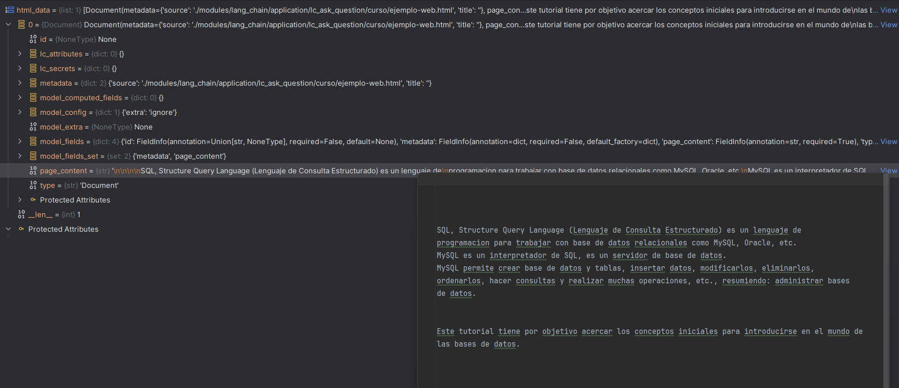
- **resumir contenido de un pdf**
- 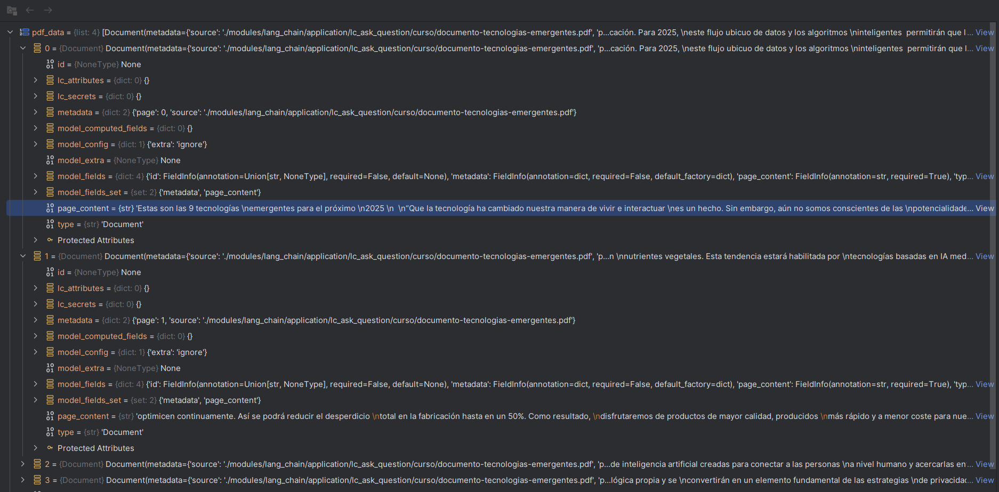
```python
from langchain.document_loaders import (
    PyPDFLoader
)

def ejemplo_resumir_pdf(self) -> str:

    prompt_conf = {
        "summarize": {
            "human": {
                "prompt_tpl": HumanMessagePromptTemplate.from_template(
                    "Necesito que hagas un resume del siguiente texto: \{pdf_content}"
                ),
            }
        },
    }

    chat_prompt_tpl = ChatPromptTemplate.from_messages([
        prompt_conf.get("summarize").get("human").get("prompt_tpl"),
    ])

    path = "./modules/lang_chain/application/lc_ask_question/curso/documento-tecnologias-emergentes.pdf"
    pdf_content = self.__get_pdf_content(path)
    print(pdf_content)
    chat_prompt_formatted = chat_prompt_tpl.format_prompt(
        pdf_content = pdf_content
    )

    lm_input_request = chat_prompt_formatted.to_messages()
    ai_message = self._get_chat_openai().invoke(lm_input_request)
    summarized_content = ai_message.content

    return summarized_content

def __get_pdf_content(self, path: str) -> str:
    pdf_loader = PyPDFLoader(file_path=path)
    pdf_data = pdf_loader.load()
    pdf_content = []

    for page in pdf_data:
        pdf_content.append(page.page_content)

    return "\n".join(pdf_content)
```
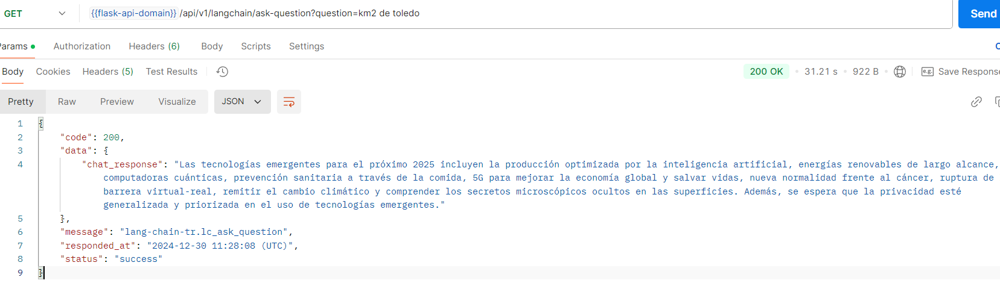

### cargadores de tipo integración (integration loaders)
- Permite la carga de fuente de datos concreta.
- Ejemplo: AWS, Google Drive, Dropbox, MongoDB, Wikipedia, Youtube, Azure, etc
- Son abstracciones de tipo repositiorio que permiten solicitar información de estos servicios externos.
```python
# pip install wikipedia
from langchain.document_loaders import WikipediaLoader
def ejemplo_resumir_wikipedia(self) -> str:

    topic = "Fernando Alonso"
    user_question = "¿Cuándo nació?"

    lang = "es"
    load_max_docs = 5

    wikipedia_loader = WikipediaLoader(
        query = topic,
        lang = lang,
        load_max_docs = load_max_docs
    )
    wikipedia_data = wikipedia_loader.load()
    print(wikipedia_data[0].page_content)
    wiki_content = wikipedia_data[0].page_content # por optimizar solo pasamos el primer documento

    prompt_conf = {
        "wikipedia": {
            "human": {
                "prompt_tpl": HumanMessagePromptTemplate.from_template(
                    "Responde a esta pregunta:\n{human_question}, aquí tienes contenido extra:\n{context_info}"
                ),
            }
        },
    }
    chat_prompt_tpl = ChatPromptTemplate.from_messages([
        prompt_conf.get("wikipedia").get("human").get("prompt_tpl"),
    ])
    chat_prompt_formatted = chat_prompt_tpl.format_prompt(
        context_info = wiki_content,
        human_question = user_question,
    )
    lm_input_request = chat_prompt_formatted.to_messages()
    ai_message = self._get_chat_openai().invoke(lm_input_request)
    ai_wiki_response = ai_message.content

    return ai_wiki_response
```


#### transformacion de documentos 
- son troceadores semanticos de información en **chunks**
- Viene a solucionar el límite de información soportado por un modelo.
- Este límite esta en el rango de 8K tokens +/- 6K palabras.
- Estos chunks serviran en su forma vectorial (embeddings) para buscar similitudes de acuerdo a su distancia
- Por ejemplo, podremos alimentar un modelo LLM con contexto adicional para afinar su respuesta.
```python
def ejemplo_transformer(self) -> str:
    path = "./modules/lang_chain/application/lc_ask_question/curso/historia-espana.txt"
    historia_espana = get_file_content(path)
    len(historia_espana) # 85369
    len(historia_espana.split(" ")) # 13701

    text_splitter = CharacterTextSplitter(
        separator = "\n",
        chunk_size = 1000
    )
    chunks = text_splitter.create_documents([historia_espana])
    print(type(chunks)) # <class 'list'>
    print(type(chunks[0]))
    return chunks[0].page_content
```
#### incrustación de textos y creación de vectores (embeddings)
- 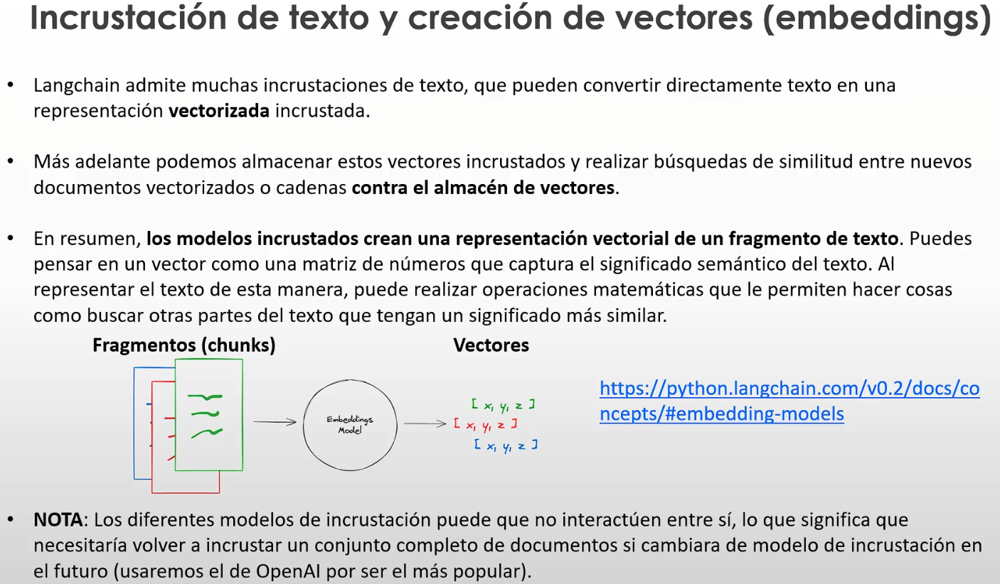
```python
def ejemplo_embeddings(self) -> str:
    csv_data = self.ejemplo_get_datos_ventas_small_con_csv_loader()
    openai_embeddings = self._get_embeddings_openai()
    embedded_docs = openai_embeddings.embed_documents([
        page.page_content for page in csv_data
    ])
    len(embedded_docs) # 22
    return embedded_docs[0]
```
- 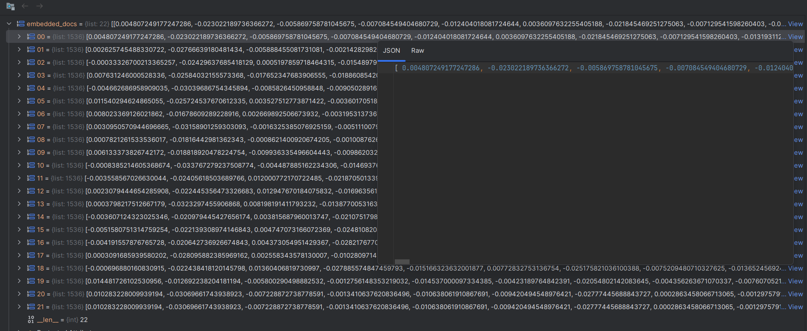
#### almacenamiento de vectores en base de datos
- hasta ahora hemos generado los **embeddings** en tiempo real, es decir en RAM.
- Podemos almacenar estos vectores en una **base de datos de vectores** 
- caracterisiticas de bases de datos vectoriales:
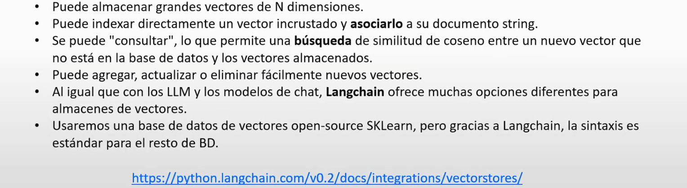
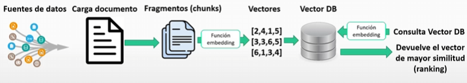
- Una vez que se tenga el contenido de un texto en vectores cuando se haga una consulta sobre este se podra
obtener los documentos más similares a este (ranking)
```python
def ejemplo_save_embeddings(self)-> str:
    sklearn_repository = EjemplosSklearnRepository.get_instance()

    vector_db = None
    consulta = "dame información de la Primera Guerra Mundial"
    if sklearn_repository.db_exists():
        consulta = "¿Qué pasó en el siglo de Oro?"
        print("db exists")
        vector_db = sklearn_repository.get_openai_db()

    if not sklearn_repository.db_exists():
        print("creating db")
        path = "./modules/lang_chain/application/lc_ask_question/curso/historia-espana.txt"
        texts = TextLoader(file_path=path, encoding="utf8").load()
        text_splitter = CharacterTextSplitter.from_tiktoken_encoder(chunk_size=500)
        vectorized_docs = text_splitter.split_documents(texts)
        vector_db = sklearn_repository.create_openai_db_by_documents(
            vectorized_docs
        )


    # busqueda seno. convierte consulta en un vector y lo comparará con lo que hay en la bd
    # recuperara los vectores que hablen de la Primera Guerra Mundial
    matched_docs = vector_db.similarity_search(consulta)

    print(matched_docs[0].page_content)
    return f"{consulta}\n{matched_docs[0].page_content}"
```
- parquet example
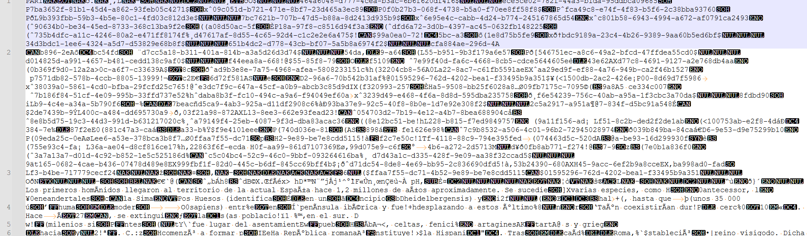
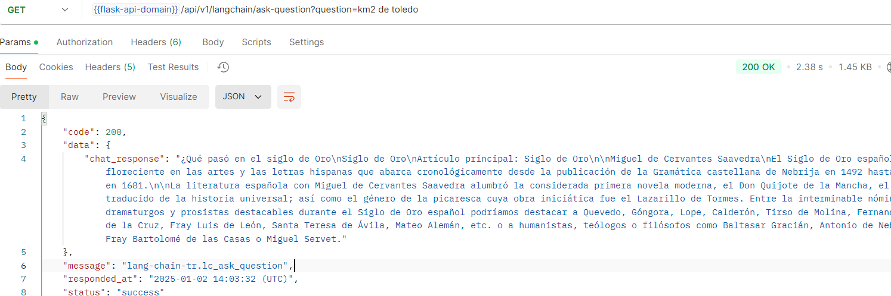

#### compresion y optimizacion de resultados
- 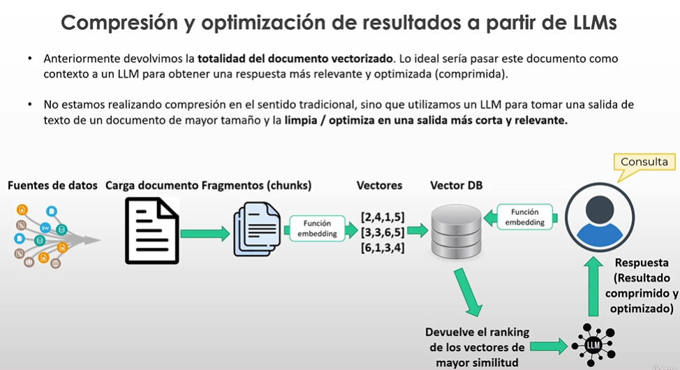
```python
def ejemplo_compresion_y_optimizacion_de_resultados(self)-> str:
    sklearn_repository = EjemplosSklearnRepository.get_instance()

    vector_db = None
    consulta = "¿Por qué él lenguaje Python se llama así?"
    if sklearn_repository.db_optimization_exists():
        print("db optimization exists")
        vector_db = sklearn_repository.get_optimization_db()

    if not sklearn_repository.db_optimization_exists():
        print("creating optimization db")
        wikipedia_loader = WikipediaLoader(
            query="Lenguaje python",
            lang="es",
            load_max_docs = 5
        )
        wikipedia_data = wikipedia_loader.load()
        char_splitter = CharacterTextSplitter.from_tiktoken_encoder(chunk_size=500)
        wikipedia_chunks = char_splitter.split_documents(wikipedia_data)

        vector_db = sklearn_repository.create_optimization_db_by_documents(
            wikipedia_chunks
        )


    # esta no es la forma optimizada devuelve todo el contenido de wikipedia
    # matched_docs = vector_db.similarity_search(consulta)

    # en la forma optimizada se le solicita al llm de compresion y no la bd
    compression_retriever = sklearn_repository.get_compression_retriever()
    matched_docs = compression_retriever.invoke(consulta)

    print(matched_docs[0].page_content)
    return f"{consulta}\n{matched_docs[0].page_content}"
```
## cadenas en langchain
- **modelo secuencial simple**
- 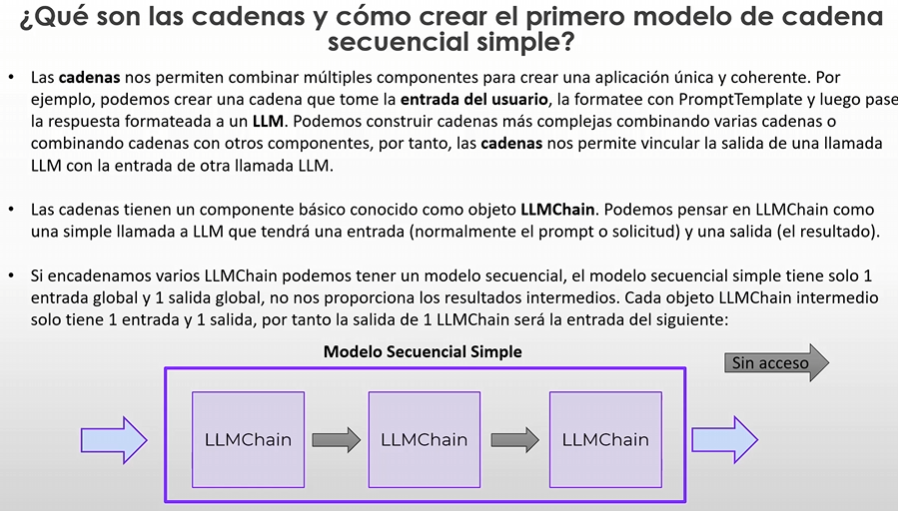
```python
def ejemplo_cadena_secuencia_simple(self) -> str:
    open_ai_chat = self._get_chat_openai()
    prompt_conf = {
        "gimme-summary": LLMChain(
            llm=open_ai_chat,
            prompt=ChatPromptTemplate.from_template(
                "Dame un simple resumen con un listado de puntos para un post de un blog acerca de {topic}"
            )
        ),
        "create-a-post": LLMChain(
            llm=open_ai_chat,
            prompt=ChatPromptTemplate.from_template(
                "Escribe un post completo usando este resumen: {summary}"
            )
        ),
    }

    full_chain = SimpleSequentialChain(
        chains=[prompt_conf.get("gimme-summary"), prompt_conf.get("create-a-post")],
        verbose=True # nos ira dando paso a paso lo que se va haciendo por consola
    )

    dic_response = full_chain.invoke(input="Inteligencia Artificial")

    return f"{dic_response.get("input")}:\n{dic_response.get("output")}"
```
#### modelo secuencial completo
- 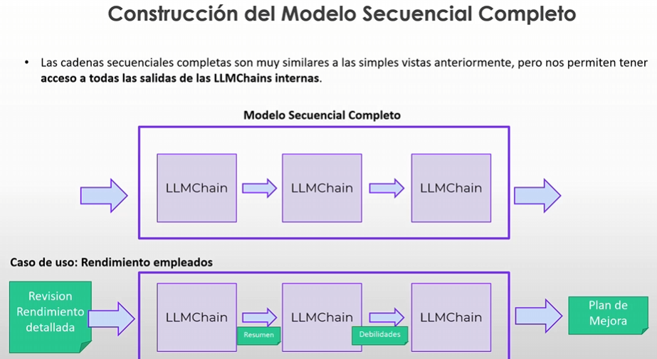
```python
from langchain.chains import SequentialChain

def ejemplo_cadena_secuencia_completo(self) -> str:
    open_ai_chat = self._get_chat_openai()
    prompt_conf = {
        "employee-performance": LLMChain(
            llm = open_ai_chat,
            prompt = ChatPromptTemplate.from_template(
                "Dame un resumen del rendimiento de este trabajador:\n{performance_review}"
            ),
            output_key = "employee_performance",
        ),
        "employee-weaknesses": LLMChain(
            llm = open_ai_chat,
            prompt = ChatPromptTemplate.from_template(
                "Identifica las debilidades de este trabajador dentro de de este resumen de la revisión:\n{employee_performance}"
            ),
            output_key = "employee_weaknesses",
        ),
        "improve-plan":  LLMChain(
            llm = open_ai_chat,
            prompt = ChatPromptTemplate.from_template(
                "Crea un plan de mejora para ayudar en estas debilidades:\n{employee_weaknesses}"
            ),
            output_key="improve_plan",
        ),
    }

    full_chain = SequentialChain(
        chains=[prompt_conf.get("employee-performance"), prompt_conf.get("employee-weaknesses"), prompt_conf.get("improve-plan")],
        input_variables=["performance_review"],
        output_variables=["employee_performance", "employee_weaknesses", "improve_plan"],
        verbose=True,
    )

    # esto podria venir de una base de datos
    performance_review = '''
Revisión de Rendimiento del Empleado

Nombre del Empleado: Juan Pérez,
Posición: Analista de Datos,
Período Evaluado: Enero 2023 - Junio 2023,

Fortalezas:
Juan ha demostrado un fuerte dominio de las herramientas analíticas y ha proporcionado informes detallados y precisos 
que han sido de gran ayuda para la toma de decisiones estratégicas. Su capacidad para trabajar en equipo y su disposición 
para ayudar a los demás también han sido notables. Además, ha mostrado una gran ética de trabajo y una actitud positiva 
en el entorno laboral.

Debilidades:
A pesar de sus muchas fortalezas, Juan ha mostrado áreas que necesitan mejoras. En particular, se ha observado que a 
veces tiene dificultades para manejar múltiples tareas simultáneamente, lo que resulta en retrasos en la entrega de proyectos. 
También ha habido ocasiones en las que la calidad del trabajo ha disminuido bajo presión. Además, se ha identificado 
una necesidad de mejorar sus habilidades de comunicación, especialmente en lo que respecta a la presentación de datos 
complejos de manera clara y concisa a los miembros no técnicos del equipo. Finalmente, se ha notado una falta de proactividad 
en la búsqueda de soluciones a problemas imprevistos, confiando a menudo en la orientación de sus superiores en lugar 
de tomar la iniciativa.        
    '''

    dic_response = full_chain.invoke(performance_review)

    return f"{dic_response.get("performance_review")}:\n{dic_response.get("employee_performance")}\n{dic_response.get("employee_weaknesses")}\n{dic_response.get("improve_plan")}"
```
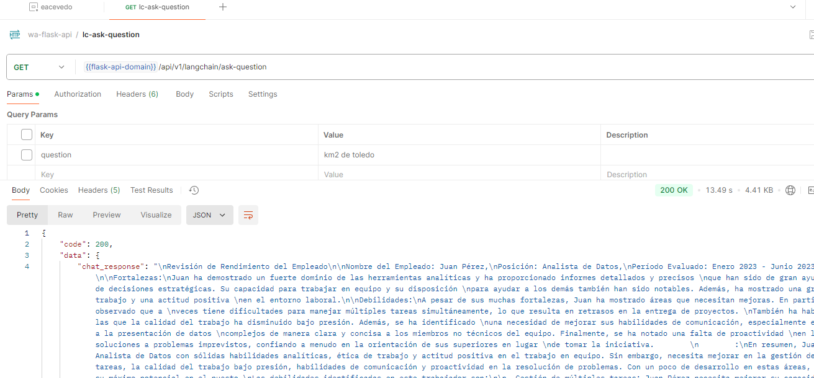

#### Enrutamiento a cadenas con LLMRouterChain
- 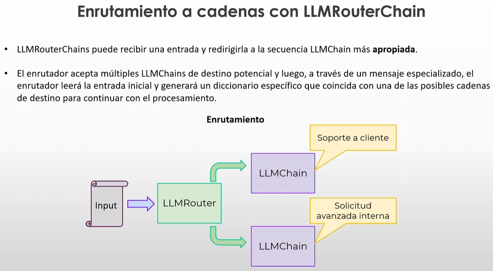
```python
from langchain.chains.router.llm_router import (
    LLMRouterChain,
    RouterOutputParser
)
from langchain.chains.router import MultiPromptChain

def ejemplo_enrutamiento_de_cadenas(self) -> str:
    plantilla_soporte_basico = '''
Eres una persona que asiste a los clientes de automóviles con preguntas básicas que pueden,
necesitar en su día a día y que explica los conceptos de una manera que sea simple de entender. 
Asume que no tienen conocimiento,previo. Esta es la pregunta del cliente/n{input}
'''
    plantilla_soporte_avanzado_mecanico = '''
Eres un experto en mecánica que explicas consultas avanzadas a los mecánicos,
de la plantilla. Puedes asumir que cualquier que está preguntando tiene conocimientos avanzados de mecánica.
Esta es la pregunta del cliente/n{input}
'''
    prompt_info = [
        {
            "name": "mecánica básica", "description": "Responde preguntas básicas de mecánica a clientes",
            "prompt_template": plantilla_soporte_basico,
        },
        {
            "name": "mecánica avanzada", "description": "Responde preguntas avanzadas de mecánica a a expertos con conocimiento previo",
            "prompt_template": plantilla_soporte_avanzado_mecanico,
        },
    ]

    destination_chains = {}
    chat_open_ai = self._get_chat_openai()
    for p_info in prompt_info:
        name = p_info.get("name")
        prompt_template = p_info.get("prompt_template")
        chat_prompt_tpl = ChatPromptTemplate.from_template(prompt_template)
        llm_chain = LLMChain(llm = chat_open_ai, prompt = chat_prompt_tpl)
        destination_chains[name] = llm_chain

    destinations = [f"{p["name"]}: {p["description"]}" for p in prompt_info]
    str_destinations = "\n".join(destinations)

    router_template = MULTI_PROMPT_ROUTER_TEMPLATE.format(destinations=str_destinations) # el parametro importante es el "destinations" , debemos formatearlo en tipo string
    router_prompt_tpl = PromptTemplate(
        template=router_template,
        input_variables=["input"],
        output_parser=RouterOutputParser(),  #para transformar el objeto JSON parseandolo a una string
    )
    router_chain = LLMRouterChain.from_llm(llm=chat_open_ai, prompt=router_prompt_tpl)

    # creamos el prompt y cadena por defecto puesto que son arumentos obligatorios que usaremos posteriormente
    default_chain = LLMChain(
        llm=chat_open_ai,
        prompt=ChatPromptTemplate.from_template("{input}")
    )
    llm_chain = MultiPromptChain(
        router_chain = router_chain,
        destination_chains=destination_chains, # los llms con los roles de niveles de respuesta,
        default_chain=default_chain, #la entrada principal
        verbose=True,
    )

    # dic_response = llm_chain.invoke("¿Cómo cambio el aceite de mi coche?")  # input de mecanica basica
    dic_response = llm_chain.invoke("¿Cómo funciona un catalizador?") # input de mecanica avanzada

    return f"{dic_response.get("input")}:\n{dic_response.get("text")}"
```
- 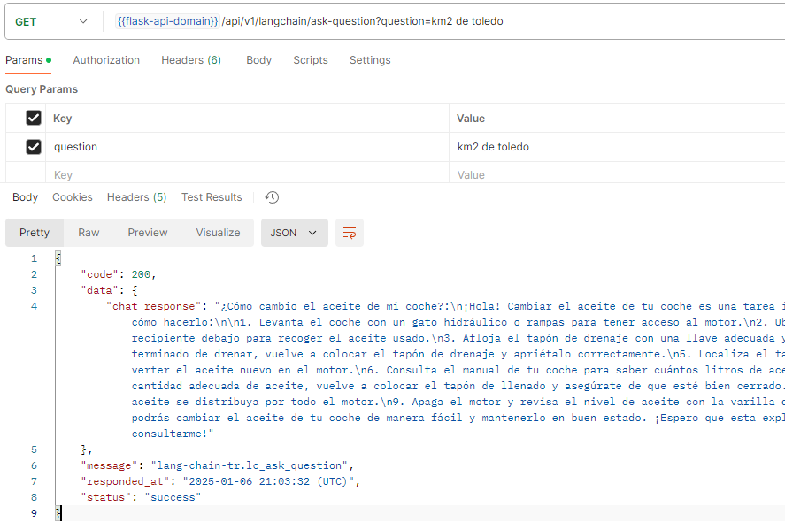
- 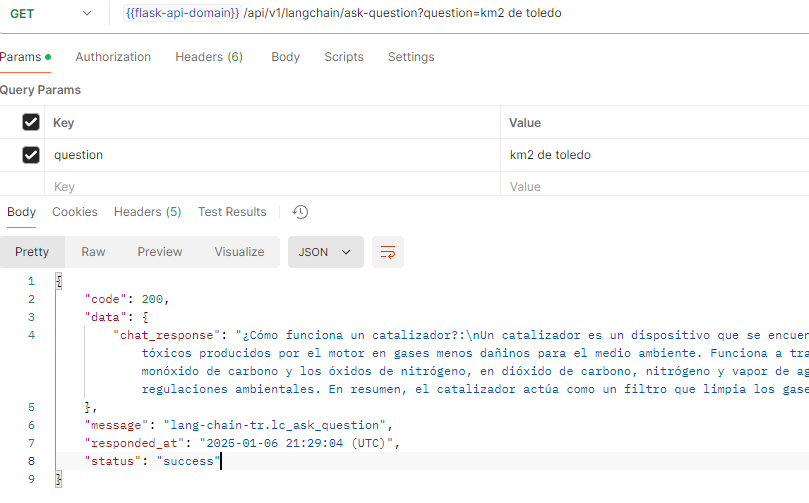

#### cadenas de transformacion
- Son clases que llevan una funcion de callback como argumento al que invocan para aplicar la transformacion correspondiente
- 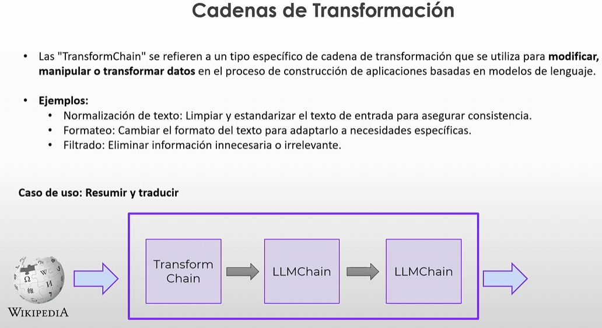
```python
def ejemplo_cadenas_transformacion(self) -> str:
    wikipedia_query = "Real Madrid"
    final_language = "francés"

    wikip_loader = WikipediaLoader(query=wikipedia_query, lang="es", load_max_docs=1)
    wikipedia_data = wikip_loader.load()

    # el texto del primer documento es muy grande y no lo necesitamos todo
    wiki_page1 = wikipedia_data[0].page_content
    print(f"texto-wiki-page1: {wiki_page1}")

    def fn_get_first_paragraph(inputs: dict) -> dict:
        texto = inputs.get("texto")
        primer_parrafo = texto.split("\n")[0]
        print(f"primer_parrafo: {primer_parrafo}")
        return {
            "salida": primer_parrafo
        }

    transform_chain = TransformChain(
        input_variables = ["texto"],
        output_variables = ["salida"],
        transform = fn_get_first_paragraph # aunque no lo detecta como un argumento lo construye en ejecución a partir de kwargs
    )

    chat_open_ai = self._get_chat_openai()
    llm_chain = {
        "create-summary": LLMChain(
            llm=chat_open_ai,
            prompt=ChatPromptTemplate.from_template("Crea un resumen de este texto:\n{texto}"),
            output_key="summary_text"
        ),
        "translate": LLMChain(
            llm=chat_open_ai,
            # texto vendra de la cadena 1 (create-summary)
            prompt=ChatPromptTemplate.from_template("Traduce este texto al "+final_language+" el siguiente texto:\n{texto}"),
            output_key="translated_text"
        )
    }

    # no entiendo esta parte que hace? devuelve una clase del mismo tipo?
    simple_sequential_chain = SimpleSequentialChain(
        chains = [transform_chain, llm_chain.get("create-summary"), llm_chain.get("translate")],
        verbose = True
    )

    # aqui llama a simple_sequential_chain.__call__
    dic_response = simple_sequential_chain(wiki_page1)

    # return f"{dic_response.get("input")}\n{dic_response.get("output")}"
    return f"{wikipedia_query} ({final_language})\n{dic_response.get("output")}"
```
- 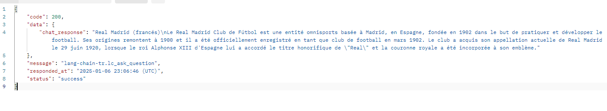
- 