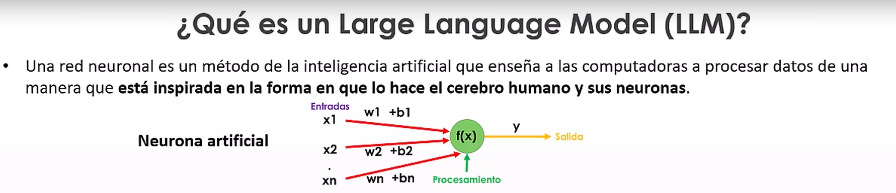
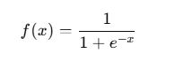
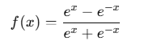
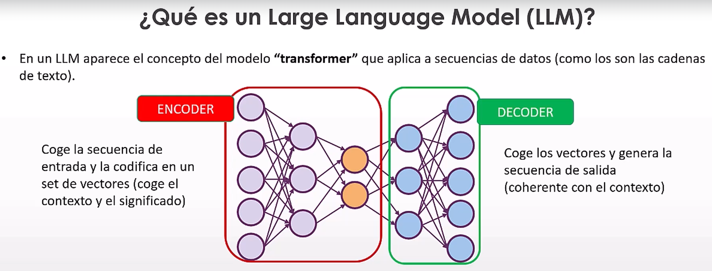

### Neurona artificial:
- 
- Es una representacion matematica de una neurona biologica
- Una neurona se compone de:
  1. Xn entradas
  2. Wi pesos 
  3. Bj bias (sesgo)
  4. f **funcion de activación**
    - aplica funciones matematicas complejas que evitan la linealidad en el modelo
    - Ejemplos:
      - Sigmoide: 
      - Tangente hiperbolica:  
      - ... reul, leaky ReLU, etc cada una se ajusta a un tipo de problema
  5. Output

### Red de neuronas:
- Se compone de:
  - Red de neuronas para aceptar datos de entreda.
  - Red capa oculta para el procesamiento de cada una de las etapas.
  - Neurona de salida.

### Transformer:
- 
- Red neuronal que consta de dos capas.
- Capa de codificacion.
  - Codifica la entrada y en el contexto que se ha proporionado en un set de vecotes 
- Capa de decodificacion.
- **Mecanismo de atención**
  - El mecanismo de atención es la base del modelo Transformer, donde se utiliza la variante llamada self-attention o atención propia. Este mecanismo permite que el modelo analice cómo cada palabra en una oración está relacionada con otras palabras en la misma oración.
  - Es una herramienta poderosa que ayuda a los modelos de IA a comprender mejor las entradas, enfocándose en lo relevante y descartando lo redundante o menos importante

## Langchain
- Framework para desarrollar apps impulsadas por LLMs.
- Consta de módulos o componentes.
- [https://python.langchain.com](https://python.langchain.com/docs/introduction/)