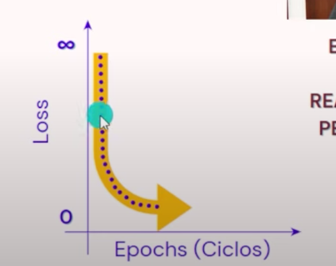

[index](https://github.com/eacevedof/prj_python37/blob/master/tensorflow/readme.md)

### [Aprende a crear una red neuronal en python](https://youtu.be/cDMoaMnbQUc?t=57)
- Hay dos capas inprescindibles la capa de entrada y de salida
- [librerias](https://youtu.be/cDMoaMnbQUc?t=691)
  - tensorflow
  - numpy
  - matplotlib

- **capa tipo densa** todas las salidas de una neurona se conecta a la entrada de otra
- **Un optimizador** es el encargado de ajustar los pesos y sesgos de la red neuronal
  - 
  - inicialmente se asume una perdida muy grande pero con cada repaso del optimizador la perdida debe tender a 0
- **metrica de perdida** es la encargada de indicarnos el tamaño del desfase de la salida devuelta y la esperada
