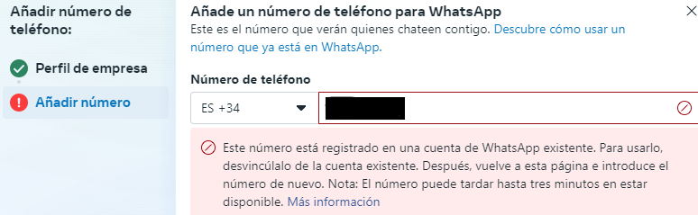

# [this repo: /wa-chatgpt](https://github.com/eacevedof/prj_python37/tree/master/wa-chtgpt)

### videos tutorial:
- [vid 1 - https://www.youtube.com/watch?v=c77so_bKXhQ](https://www.youtube.com/watch?v=c77so_bKXhQ)
- [vid 2 - https://www.youtube.com/watch?v=hNE2WPtn54A](https://www.youtube.com/watch?v=hNE2WPtn54A)
- [openai - que son los tokens](https://youtu.be/U0yBE-twgnk?t=463)


### chatgpt api keys:
- https://platform.openai.com/usage
- https://platform.openai.com/api-keys
- https://platform.openai.com/settings/organization/billing/overview
- https://platform.openai.com/docs/overview

### facebook:
- [mis facebook apps](https://developers.facebook.com/apps/)
- [agregar telefono de empresa](https://business.facebook.com/latest/whatsapp_manager/phone_numbers/)
  - 
  - 
- [configurar api key](https://developers.facebook.com/apps/42180361048294/whatsapp-business/wa-dev-console/)

#### openai:
```sh

```

#### flet
- [flet](https://flet.dev/docs/getting-started/create-flet-app)
```sh
cd fe-flet
flet create talk_bot
flet run talk_bot
```

#### embedding
- [pregunta a tu pdf con chatgpt](https://www.youtube.com/watch?v=iDrpdkIHMq8)
  - [repo](https://github.com/NechuBM/preguntaDOC/blob/main/)

#### Langchain
- [agregar memoria](https://youtu.be/lY4aGKpD-90?t=1852)